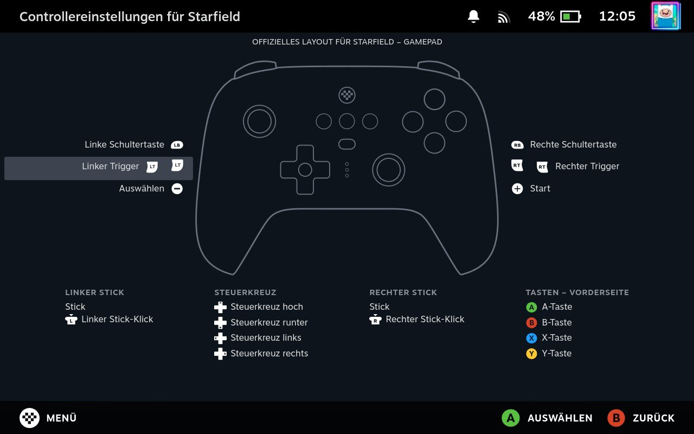

# 8BitDo Ultimate Controller Button Glyphs

Changes the Xbox Controller glyphs to ones that match the 8BitDo Ultimate Controller. It replaces 3 Glyphs (Guide, Menu, Select) and the Controller Config image.

Tested and working with:

- 8BitDo Ultimate 2.4g Controller via Dongle

## Install

Decky and the CSS Loader Plugin must already be installed and enabled.

## Credits

- [8BitDo](https://www.8bitdo.com/): for the 8BitDo Icon and the Controller image
